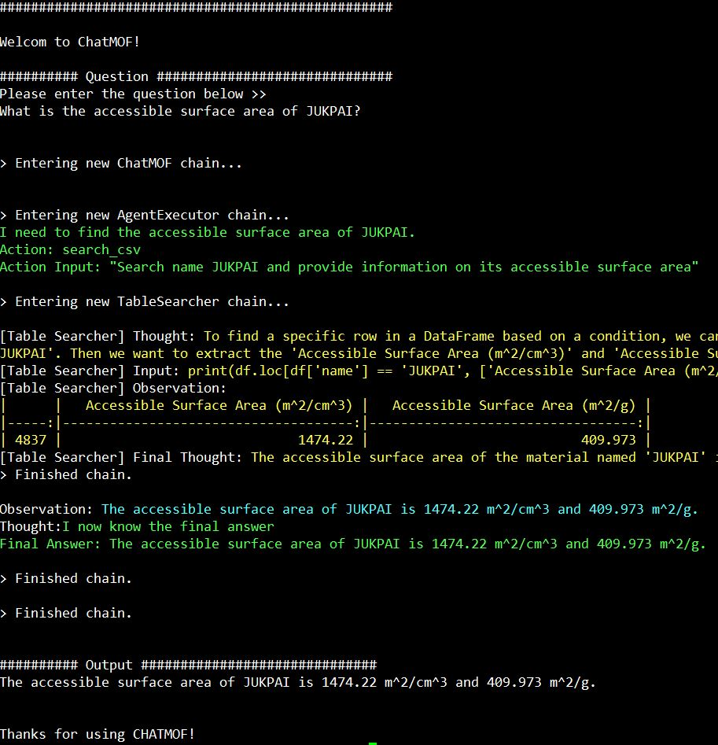
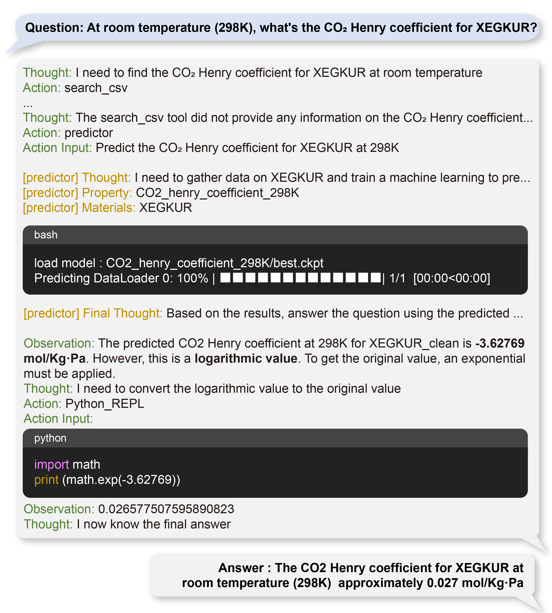
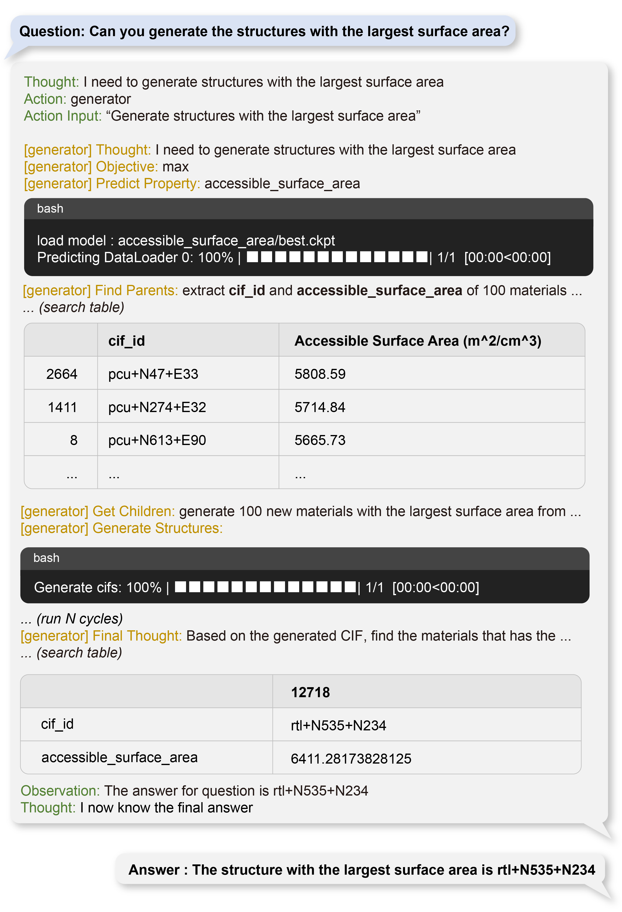
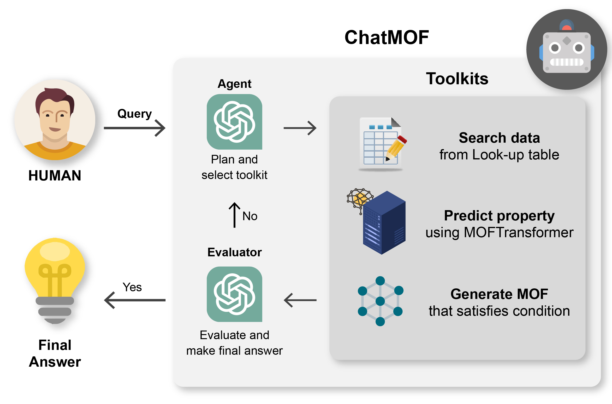

# ChatMOF : An Autonomous AI System for Predicting and Generating Metal-Organic Frameworks

ChatMOF is an autonomous Artificial Intelligence (AI) system that is built to predict and generate of metal-organic frameworks (MOFs). By leveraging a large-scale language model (gpt-3.5-turbo), ChatMOF extracts key details from textual inputs and delivers appropriate responses, thus eliminating the necessity for rigid structured queries. The system is comprised of  three core components (i.e. an agent, a toolkit, and an evaluator) and it forms a robust pipeline that manages a variety of tasks, including data retrieval, property prediction, and structure generation. The study further explores the merits and constraints of using large language models (LLMs) AI system in material sciences using and showcases its transformative potential for future advancements.

NOTE: We are working on code for a command line interface to make it easier to use.

## Install

### Dependencies

NOTE: This package is primarily tested on Linux. We strongly recommend using Linux for the installation.

```
python>=3.9
```

### Installation

```bash
$ pip install chatmof
```

For prediction and generation task, you have to setup modules.

```bash
$ chatmof setup
```

For MOF generation, you need to install MOFTransformer's GRIDAY.

```bash
$ moftransformer install-griday
```

## How to use ChatMOF
You can use it by running chatmof's `run` function.

```bash
$ chatmof run
```


You can adjust argument of Chatmof such as model and temperature

```bash
$ chatmof run --model-name gpt-3.5-turbo --temperature 0.5
```

You can use `help` to see more options.

```bash
$ chatmof run --help
```


## Example of ChatMOF
### 1) Search task


### 2) prediction task


### 3) prediction task


## Architecture

ChatMOF comprises three core components: an agent, toolkits, and an evaluator. Upon receiving a query from human, the agent formulates a plan and selects a suitable toolkit. Subsequently, the toolkit generates outputs following the proposed plan, and the evaluator makes these results into a final response.




## Citation
if you want to cite ChatMOF, please refer to the following paper:
> ChatMOF: An Autonomous AI System for Predicting and Generating Metal-Organic Frameworks, arxiv:2308.01423 [[link]](https://arxiv.org/abs/2308.01423)

## Contributing 🙌

Contributions are welcome! If you have any suggestions or find any issues, please open an issue or a pull request.

## License 📄

This project is licensed under the MIT License. See the `LICENSE` file for more information.

